# Self-Custody Made Simple
Self-custody means that you are in control of your private keys, this is how you maintain unrestricted access to your bitcoin. By extension, unrestricted access to your bitcoin means that you can send bitcoin to anyone in the world for any reason at anytime. You don't need anyone's permission, you won't be held against any financial instititution's moral standards, and nobody can stop you from making the transactions that you want to make. 

With great power comes great responsibility however, self-custody also means that you are taking radical responsibility of your bitcoin. You and you alone are responsible for managing your private keys in a way that you can access them but not your adversaries. There is no 1-800 help line, there is no reversing transactions, and there is no one that can help you recover lost or forgotten information. This may sound intimidating or complicated but tools like the Foundation Passport Batch-2 make self-custody very simple and easy to manage. 

## Unboxing the Passport Batch-2
Passport Batch-2 is shipped in a nondescript white box. There will be a shipping label (peeled off for privacy reasons) and a blue tamper-evident seal on the outside of the box. The tamper-evident seal will be placed over the opening flap of the box and the seal will have a number on it that starts with `B799`, `B862`, or `B863`. The full-length unique numbers are not saved by Foundation Devices but the prefix is used to identify the production batch the device was manufactured in. You can find a maintained list of these prefixes [here](https://docs.foundationdevices.com/passport/setup).

* Privacy Tip: Consider using a PO Box and an alias to avoid connecting your personally identifiable information to Bitcoin related items.
* Security Tip: If the security seal shows any signs of tampering, contact mailto:hello@foundationdevices.com

  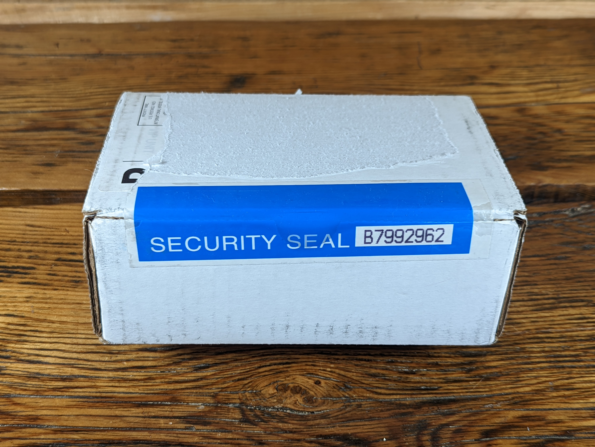
  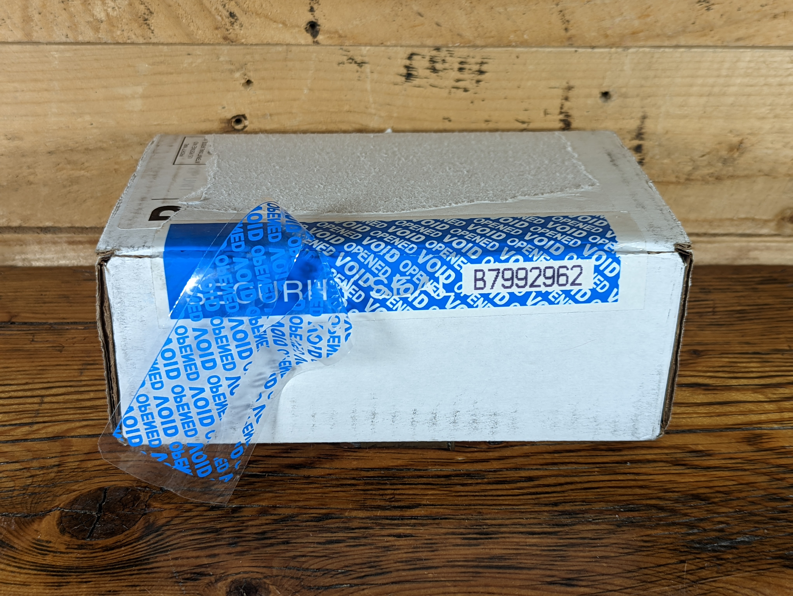

  

Inside the shipping box is the device box, it should be wrapped in bubble packaging. 
  

  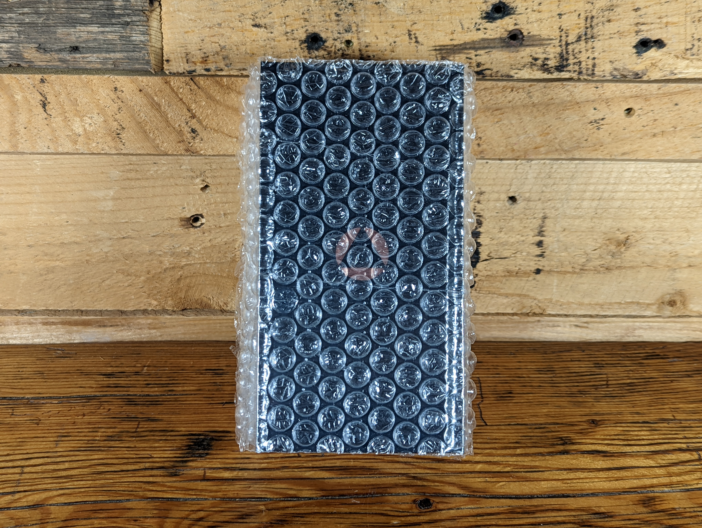
  

   

Inside the device box you will find:

- Passport Batch-2 Bitcoin hardware wallet
- 8GB microSD card
- USB-C to USB-C charging cable
- microSD to Android port adaptor
- microSD to iPhone port adaptor
- Getting started litirature
- Seed phrase and backup code card
- Foundation Stickers

  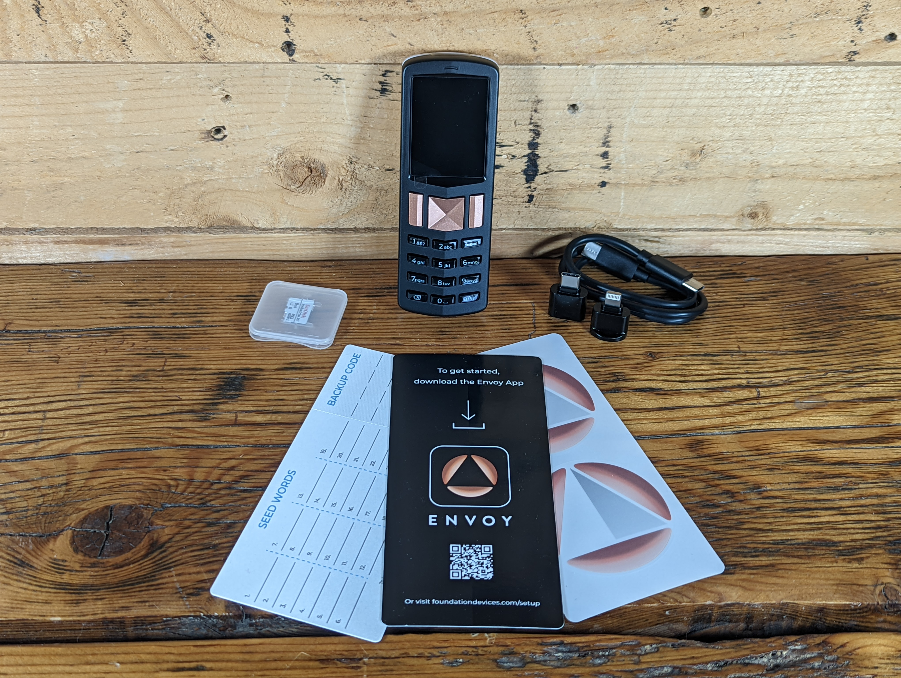
  
  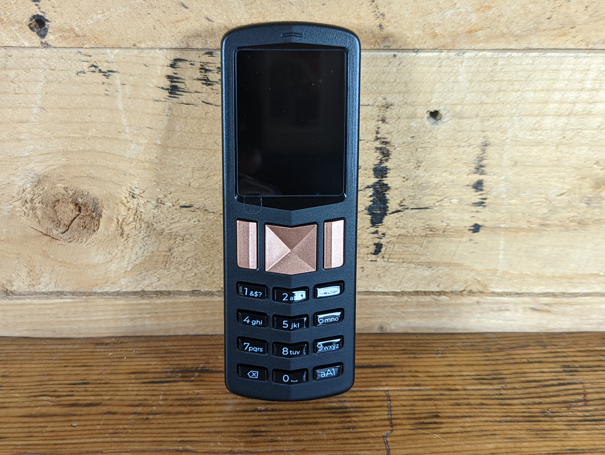
  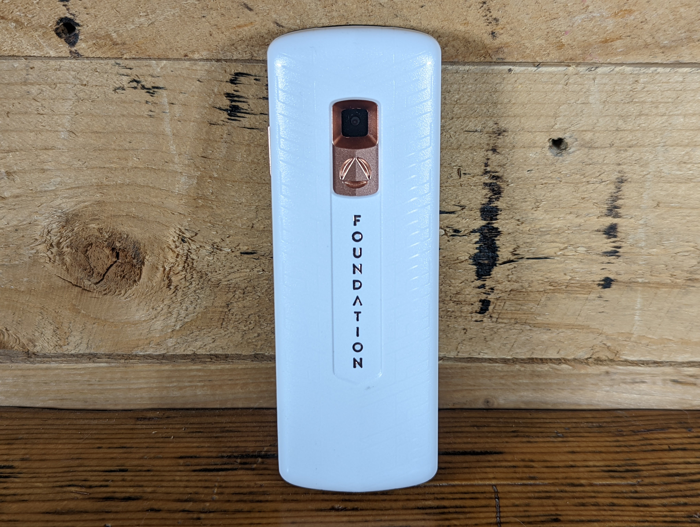
  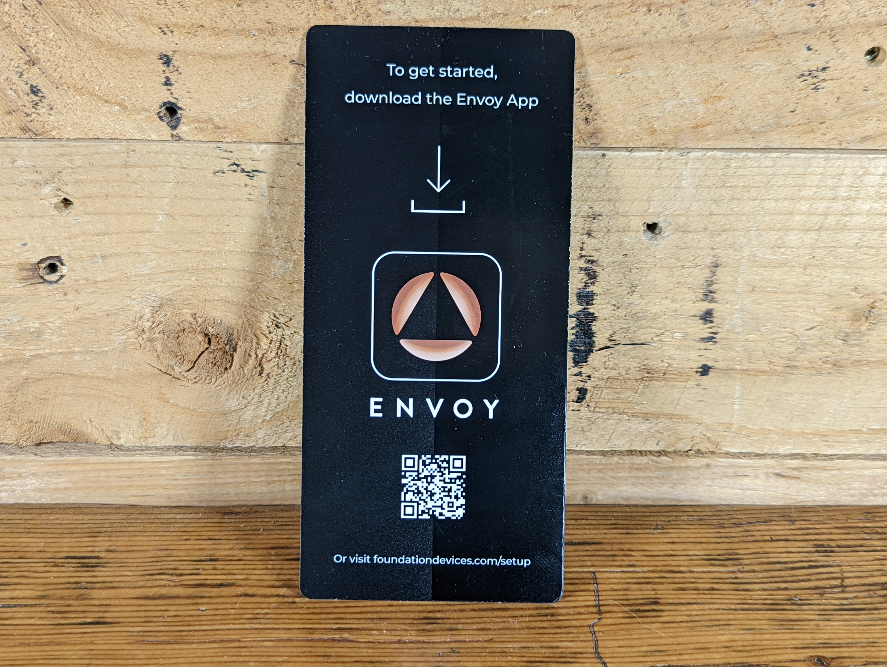
  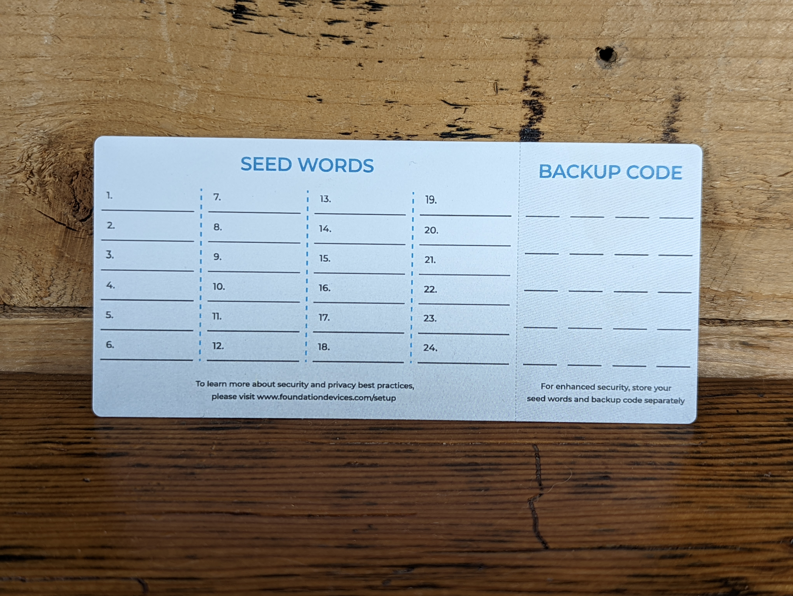

  

## Downloading Envoy
[Envoy](https://foundationdevices.com/envoy/) is a companion app for the Passport Batch 2. This app is available for iPhone or Android and enables a secure guided setup experience for your Passport Batch 2. You can also use it to install the latest firmware updates from your mobile device using the included microSD adaptors. The security validation to ensure your Passport Batch 2 has not been tampored with in transit can also be completed from the Envoy app. There is a beginner-friendly Bitcoin wallet built into Envoy that enables you to easily send or receive bitcoin while your private keys remain secured on the Passport Batch 2. Envoy connects to the internet via [Tor](https://www.torproject.org/) by default. 

This guide will cover how to download Envoy from the F-Droid repository on an Android mobile device. The cool thing about F-Droid is that you can get apps from it without the need for a Google Play Store or Apple App Store account. The [F-Droid security model](https://f-droid.org/docs/Security_Model/) enforces that all apps have a valid signature over the entire contents of the APK file so you know you are getting the app intended for you by the developers who control the signing key of the repository you are using. 

- With your mobile device, scan the QR code on the included note card and it will take you to the Foundation Devices start page. 
- Click on the device you are setting up. In this case, Passport Batch 2.

  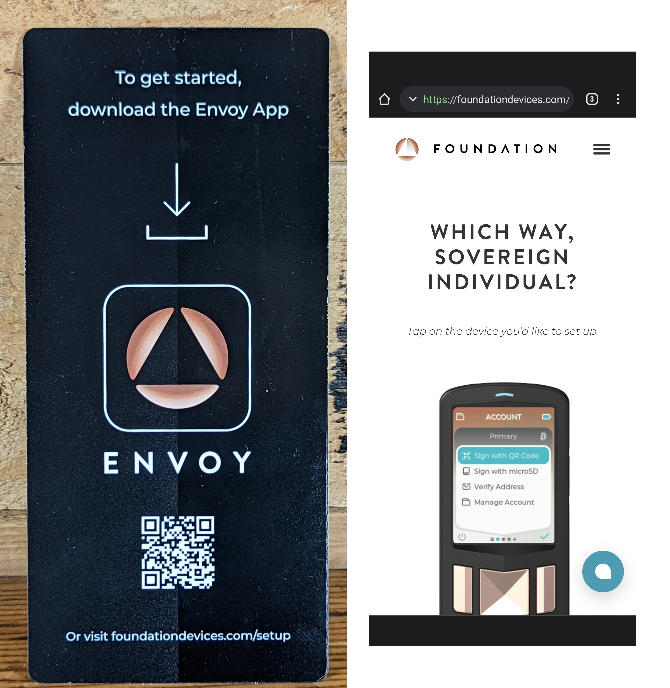

 
- This will bring you to the Foundation Devices Startup Guide which features helpful and detailed step-by-step instructions and videos. 
- Scroll down to the `Downloading Envoy` section and click on the `Envoy Download Links` link.
- Then click on the F-Droid icon. 

  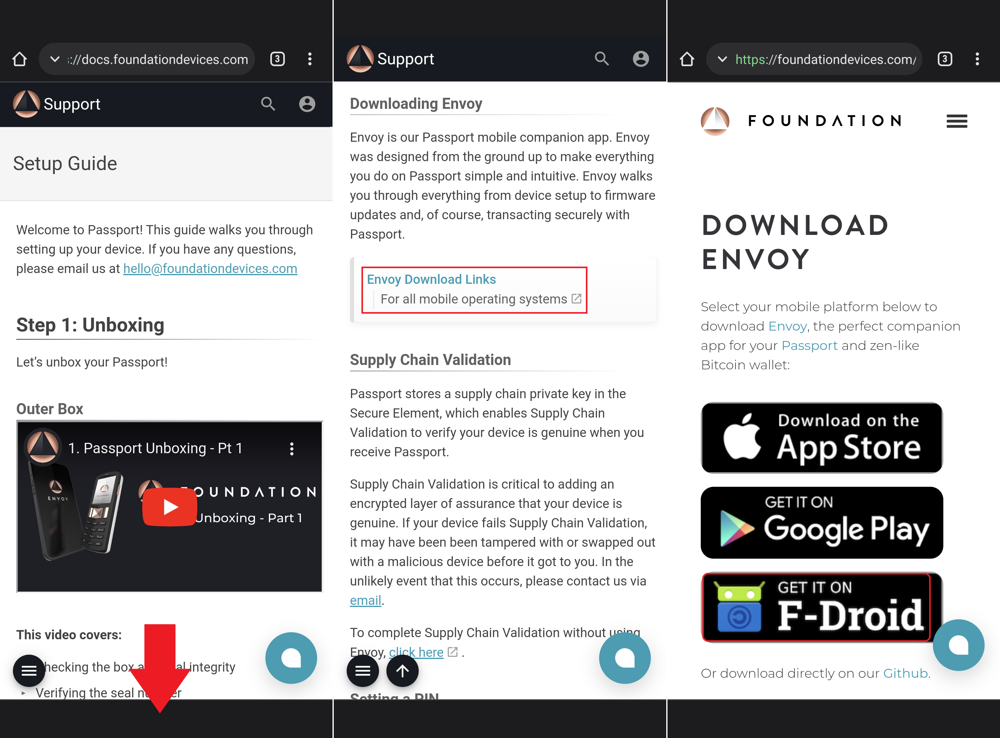

- You will be brought to the instruction page for downloading Envoy from F-Droid.
- Scroll down to step 2 under the QR code and click the link there.
- This will bring you to the summary page of the Foundation Devices F-Droid repository. Copy the link on this summary page.
- Then open your F-Droid app, click on `Settings` in the lower right-hand corner, then click on `Add additional sources of apps` under `Repositories` near the top of the menu. 

  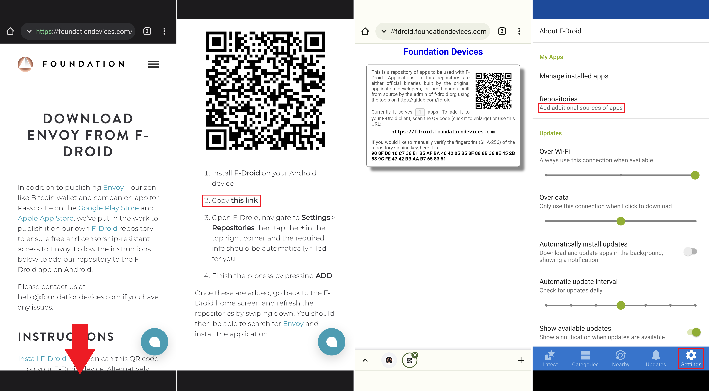

- You will be presented with a list of your currently available repositories. Click on the `+` sign in the upper right-hand corner. 
- Then paste the link you copied previously. The fingerprint is optional and can be verified at anytime against the repository summary page. Then click on `ADD`.
- Once the repository is added, you can use the search function in F-Droid from the magnifying glass icon on either the `Latest` tab or the `Categories` tab to then search for Envoy. Once found, click on the download icon.
- Once downloading is complete, click on `INSTALL`. 

  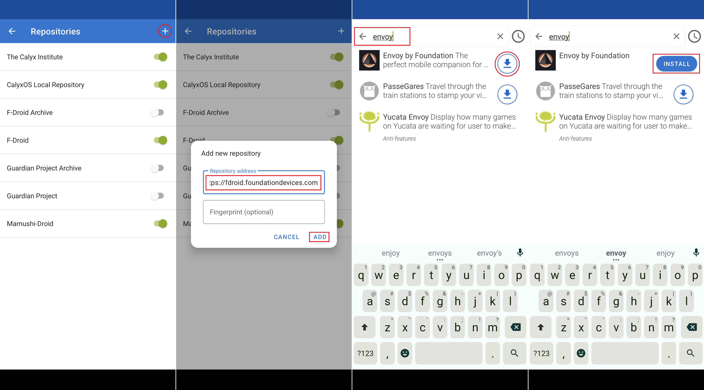

- Once installed, the Android system will ask you if you want to install this app, click on `INSTALL`. 
- Then you should be able to find the Envoy app in your app tray and you can click and hold to drag it onto your home screen if you want. Then you can open it. 
- You will be greeted with the introduction message.

  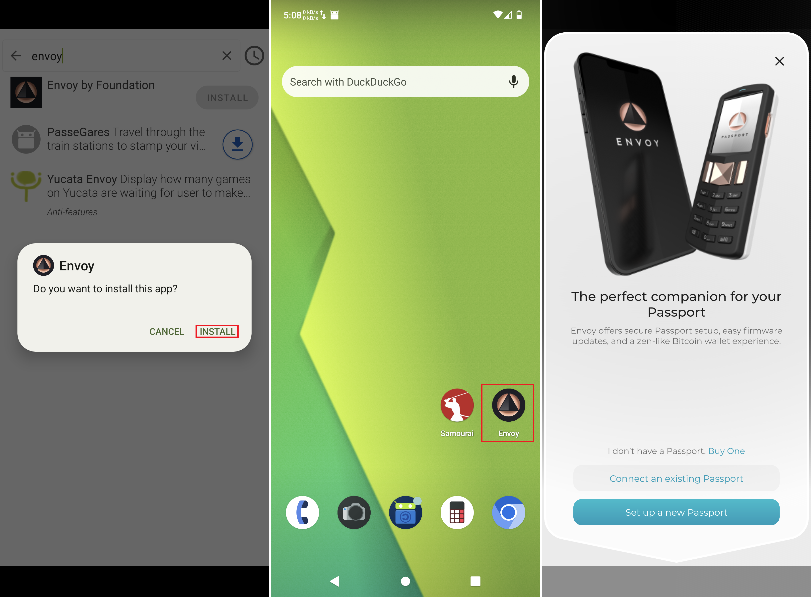

## Setting up Passport Batch 2
