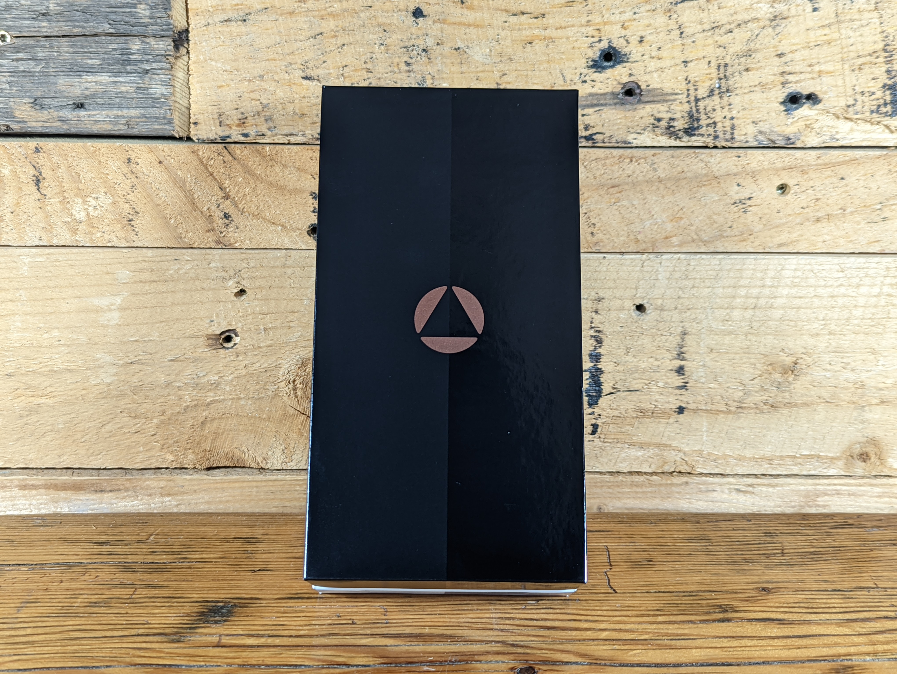
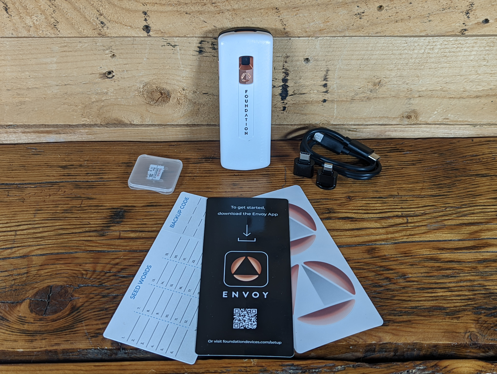
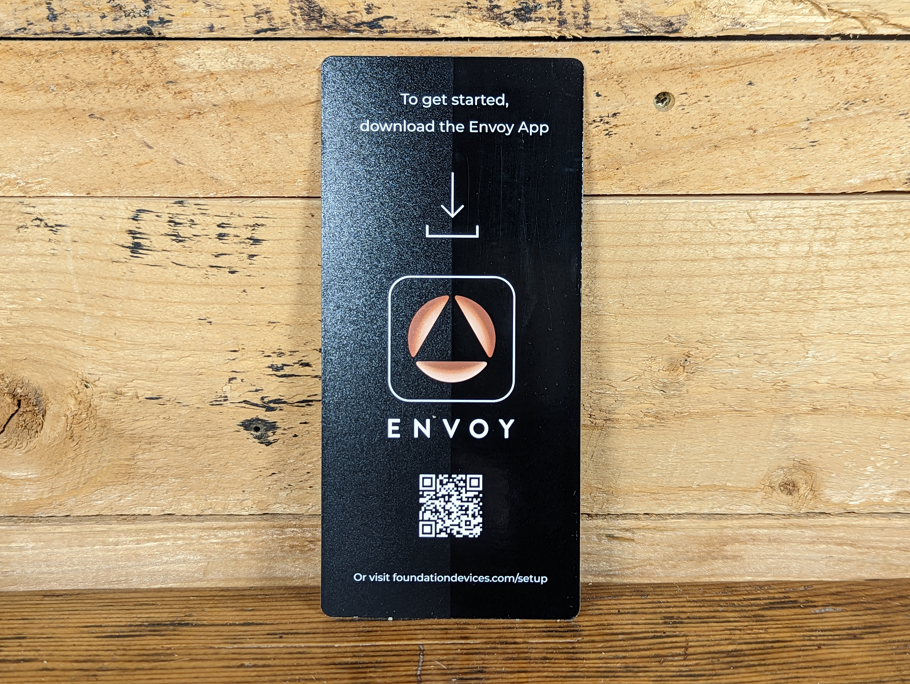
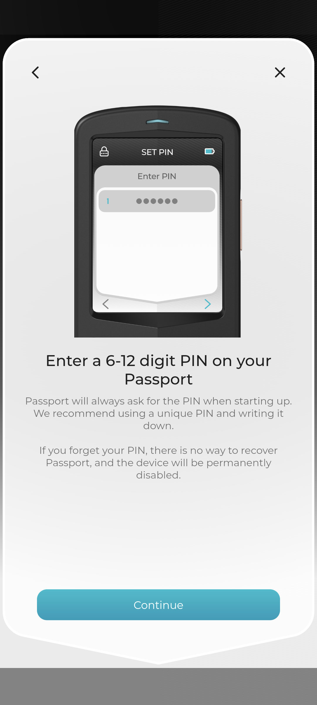

# Self-Custody Made Simple
Self-custody means that you are in control of your private keys, this is how you maintain unrestricted access to your bitcoin. By extension, unrestricted access to your bitcoin means that you can send bitcoin to anyone in the world for any reason at anytime. You don't need anyone's permission, you won't be held against any financial instititution's moral standards, and nobody can stop you from making the transactions that you want to make. 

With great power comes great responsibility however, self-custody also means that you are taking radical responsibility of your bitcoin. You and you alone are responsible for managing your private keys in a way that you can access them but not your adversaries. There is no 1-800 help line, there is no reversing transactions, and there is no one that can help you recover lost or forgotten information. This may sound intimidating or complicated but tools like the Foundation Passport Batch-2 make self-custody very simple and easy to manage. 

## Unboxing the Passport Batch-2
Passport Batch-2 is shipped in a nondescript white box. There will be a shipping label (peeled off for privacy reasons) and a blue tamper-evident seal on the outside of the box. The tamper-evident seal will be placed over the opening flap of the box and the seal will have a number on it that starts with `B799`, `B862`, or `B863`. The full-length unique numbers are not saved by Foundation Devices but the prefix is used to identify the production batch the device was manufactured in. You can find a maintained list of these prefixes [here](https://docs.foundationdevices.com/passport/setup).

* Privacy Tip: Consider using a PO Box and an alias to avoid connecting your personally identifiable information to Bitcoin related items.
* Security Tip: If the security seal shows any signs of tampering, contact mailto:hello@foundationdevices.com

  
  

  

Inside the shipping box is the device box, it should be wrapped in bubble packaging. 
  

  
  

   

Inside the device box you will find:

- Passport Batch-2 Bitcoin hardware wallet
- 8GB microSD card
- USB-C to USB-C charging cable
- microSD to Android port adaptor
- microSD to iPhone port adaptor
- Getting started litirature
- Seed phrase and backup code card
- Foundation Stickers

  
  
  
  
  
  

  

## Downloading Envoy
[Envoy](https://foundationdevices.com/envoy/) is a companion app for the Passport Batch 2. This app is available for iPhone or Android and enables a secure guided setup experience for your Passport Batch 2. You can also use it to install the latest firmware updates from your mobile device using the included microSD adaptors. The security validation to ensure your Passport Batch 2 has not been tampored with in transit can also be completed from the Envoy app. There is a beginner-friendly Bitcoin wallet built into Envoy that enables you to easily send or receive bitcoin while your private keys remain secured on the Passport Batch 2. Envoy connects to the internet via [Tor](https://www.torproject.org/) by default. 

This guide will cover how to download Envoy from the F-Droid repository on an Android mobile device. The cool thing about F-Droid is that you can get apps from it without the need for a Google Play Store or Apple App Store account. The [F-Droid security model](https://f-droid.org/docs/Security_Model/) enforces that all apps have a valid signature over the entire contents of the APK file so you know you are getting the app intended for you by the developers who control the signing key of the repository you are using. 

- With your mobile device, scan the QR code on the included note card and it will take you to the Foundation Devices start page. 
- Click on the device you are setting up. In this case, Passport Batch 2.

  

 
- This will bring you to the Foundation Devices Startup Guide which features helpful and detailed step-by-step instructions and videos. 
- Scroll down to the `Downloading Envoy` section and click on the `Envoy Download Links` link.
- Then click on the F-Droid icon. 

  

- You will be brought to the instruction page for downloading Envoy from F-Droid.
- Scroll down to step 2 under the QR code and click the link there.
- This will bring you to the summary page of the Foundation Devices F-Droid repository. Copy the link on this summary page.
- Then open your F-Droid app, click on `Settings` in the lower right-hand corner, then click on `Add additional sources of apps` under `Repositories` near the top of the menu. 

  

- You will be presented with a list of your currently available repositories. Click on the `+` sign in the upper right-hand corner. 
- Then paste the link you copied previously. The fingerprint is optional and can be verified at anytime against the repository summary page. Then click on `ADD`.
- Once the repository is added, you can use the search function in F-Droid from the magnifying glass icon on either the `Latest` tab or the `Categories` tab to then search for Envoy. Once found, click on the download icon.
- Once downloading is complete, click on `INSTALL`. 

  

- Once installed, the Android system will ask you if you want to install this app, click on `INSTALL`. 
- Then you should be able to find the Envoy app in your app tray and you can click and hold to drag it onto your home screen if you want. Then you can open it. 
- You will be greeted with the introduction message.

  

## Setting up Passport Batch 2
The first step is to complete the Supply Chain Validation. This ensures that your device has been delivered to you as the manufacturer intended; authentic and unmodified.

-  Open the Envoy app on your mobile device.
-  Select `Set up a new Passport`.
-  Accept the Terms of Use.
-  Select `Next`. You should see an animated QR code start cycling.

  

- Power on your Passport Batch 2.
- When prompted for how you would like to set up your passport, select `Envoy App`.
- Then select `Continue on Envoy`.
- Select the `>` arrow to initiate the Passport Batch 2 camera. 
- Then scan the animated QR code on your mobile device. You should see the Passport Batch 2 start counting the percentage completed until 100% of the information is received. 

  

- In the Envoy app, select `Next`. 
- On the Passport Batch 2, select `>` for next and a QR code should appear. 
- In the Envoy app, select `Continue` to initiate your mobile device's camera. 
- Scan the QR code on the Passport Batch 2 with your mobile device. 
- You should receive a notification in the Envoy app that your Passport Batch 2 is secure. If your device fails the Supply Chain Validation, it may have been been tampered with or swapped out with a malicious device while in transit to you. In the unlikely event of a failure, contact The Foundation team via email at <kbd>hello@foundationdevices.com</kbd>. If your Passport Supply Chain Validation was successful then select `Continue` in the Envoy app.  
- On the Passport Batch 2, select `Passed`. 

  

## Setting a PIN number
PIN numbers on the Passport Batch 2 can be between 6 and 12 digits in length. Using a PIN number that is easy to guess is not recommended. There is no way to recover a lost PIN number. In the event that an incorrect PIN number is entered into the Passport Batch 2 twentyone times, the device will self destruct and become permantly useless. If that occurs, your bitcoin is still safe so long as you have your seed phrase (covered in the next section), it just means the device itself is ruined.

You can also enable security words which add a layer of protection in the event that your device is ever tampered with. If you enable 

- On the Envoy app, you can just select `Continue` when you see the prompt to enter a 6-12 digit PIN. The actual PIN set up will be carried out on the Passport Batch 2. 

  

- On the Passport Batch 2, use the `>` arrow when you see the prompt to set up your PIN, which should be the first prompt you get after the Supply Chain Validation procedure. 
- Using the `>` arrow, acknowledge that there is no way to recover a lost PIN. You may want to consider writing your PIN down on paper or stamping it into metal and then storing it in a safe and secure location. 
- Using the `>` arrow, acknowledge the warning to record your PIN somewhere safe.
- Then using the numeric keys, enter your desired PIN number. 
- Then enter it again to confirm. 

  

- Next, the Passport Batch 2 will cycle through `Setting initial PIN`, `Logging in`, and finally you will receive a notice that the PIN was set successfully. 

  

Next time you turn on your Passport Batch 2, you should be prompted for your PIN before being able to use the device. 

## Generating Seed Phrase
The seed phrase is a human readable representation of the initial entropy used to generate your Bitcoin private keys. Most commonly, seed phrases will be a list of 12 or 24 words. Backing up your seed phrase in a safe and secure way will enable you to access your bitcoin in the event your wallet is lost, stolen, destroyed, etc. So long as you have your seed phrase, you have access to your bitcoin. That also means anyone else who gains access to your seed phrase has access to your bitcoin. Take precautions to ensure you save your seed phrase in a safe and secure way. There are several methods ranging from encrypted microSD cards, paper backups, [QR codes](https://econoalchemist.github.io/SeedSigner/05_Seed-Backup.html), and [steel plates](https://www.econoalchemist.com/post/the-domino-bitcoin-steel-plate-backup) or [washers](https://www.econoalchemist.com/post/backup). Whichever method you choose, your seed phrase will work with a wide range of Bitcoin wallets. Many industry participants have implemented the [BIP39](https://github.com/bitcoin/bips/blob/master/bip-0039.mediawiki) standard which defines how seed phrases work. This allows users to recover their bitcoin on a number of mobile, desktop, or hardware wallets regardless of which wallet they used to generate the seed phrase. Taking a picture or screenshot of your seed phrase is not recommended. 

- You will probably be at the prompt on your Passport Batch 2 asking you to upgrade the firmware. Since the Passport Batch 2 has not been connected to the Envoy app yet, this step will be skipped at this point and will be revisted after the seed phrase is created. You can update the firmware using the microSD card at this point if you would like to do so before continuing on to create your seed phrase. 
- If you skipped the firmware update for now, then select `Create New Seed` on the Passport Batch 2. 
- You will be asked if you want to generate a new seed phrase now, select the check mark. 
- You should see the Passport Batch 2 save the seed and then you will be notified that the new seed has been created and saved. 

  

- Next, Passport will create and encrypted backup of your seed phrase and prepare to save it to the included microSD card. Select the `>` arrow.
- Part of having an encrypted backup is having the code to decrypt it. Passport Batch 2 will generate this code and it will be required to to open your backup file in the future. Select the `>` arrow.  
- Your Passport Batch 2 came with a perfferated note card, on one side of the perferation is space to write down your seed words and on the other side is space to write down your code for the encrypted backup. Foundation recommends writing down the backup code on this notecard and it is considered a safe procedure because physical access to the microSD card is required. Consider storing the notecard and the microSD card is separate locations. Select the `>` arrow. 

  

- Your backup code will be displayed. Copy this down on your notecard. Double check your work then select the checkmark.
- Passport will ask that you confirm your backup code was written down correctly by having you re-enter it. Select the check mark.
- Enter your code in the blank spaces using the numeric key pad. 
- Once entered, select the check mark. 
- You should receive confirmation that your backup code was enetered correctly. If not, try again. 

  
  

- If you haven't done so already, insert your included microSD card into the Passport Batch 2. It never hurts to look at the microSD card on a desktop file explorer to ensure it is empty first. The Passport Batch 2 will alert you to insert the microSD card if you have not already done so. 
- Select the cycle symbol if necessary and then the Passport Batch 2 will write the backup to the microSD card.
- Then you will receive a notification that the backup is complete. 

  

## Connecting Passport Batch 2 to the Envoy app
