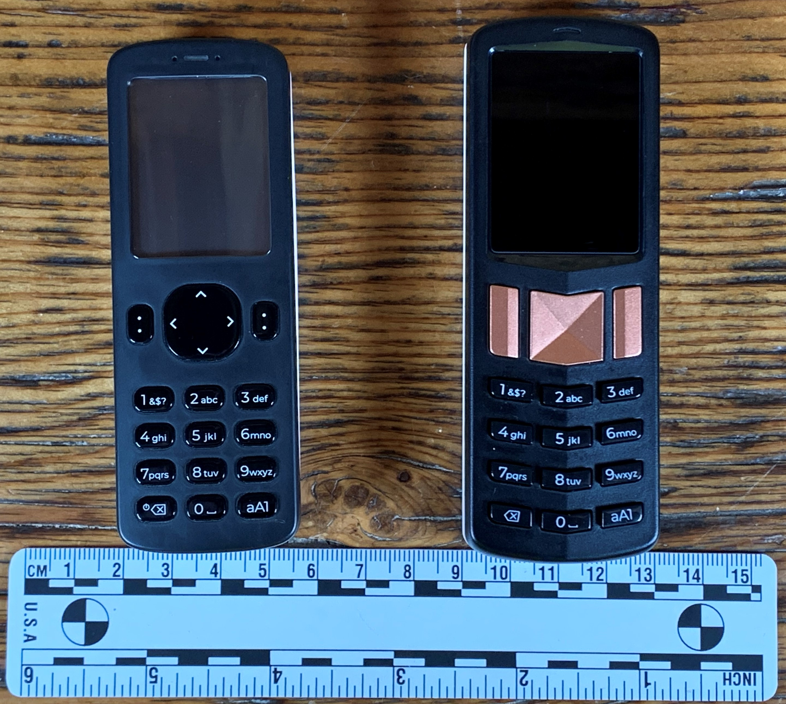
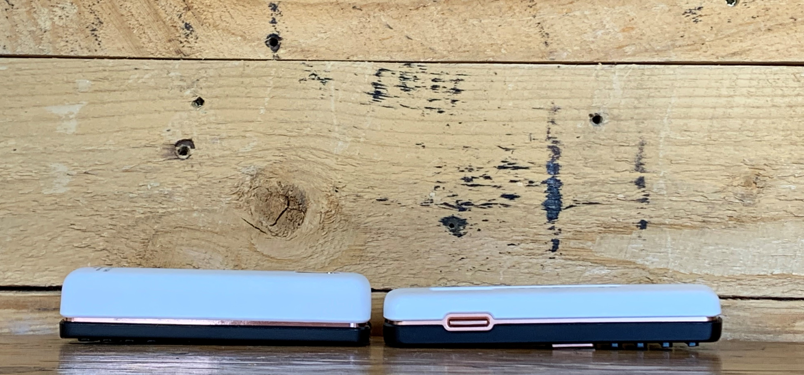
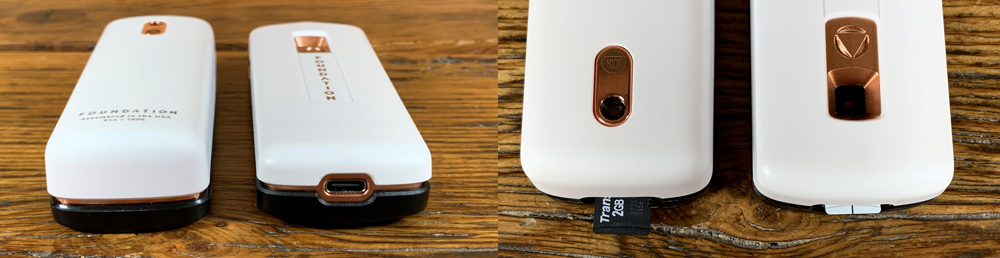
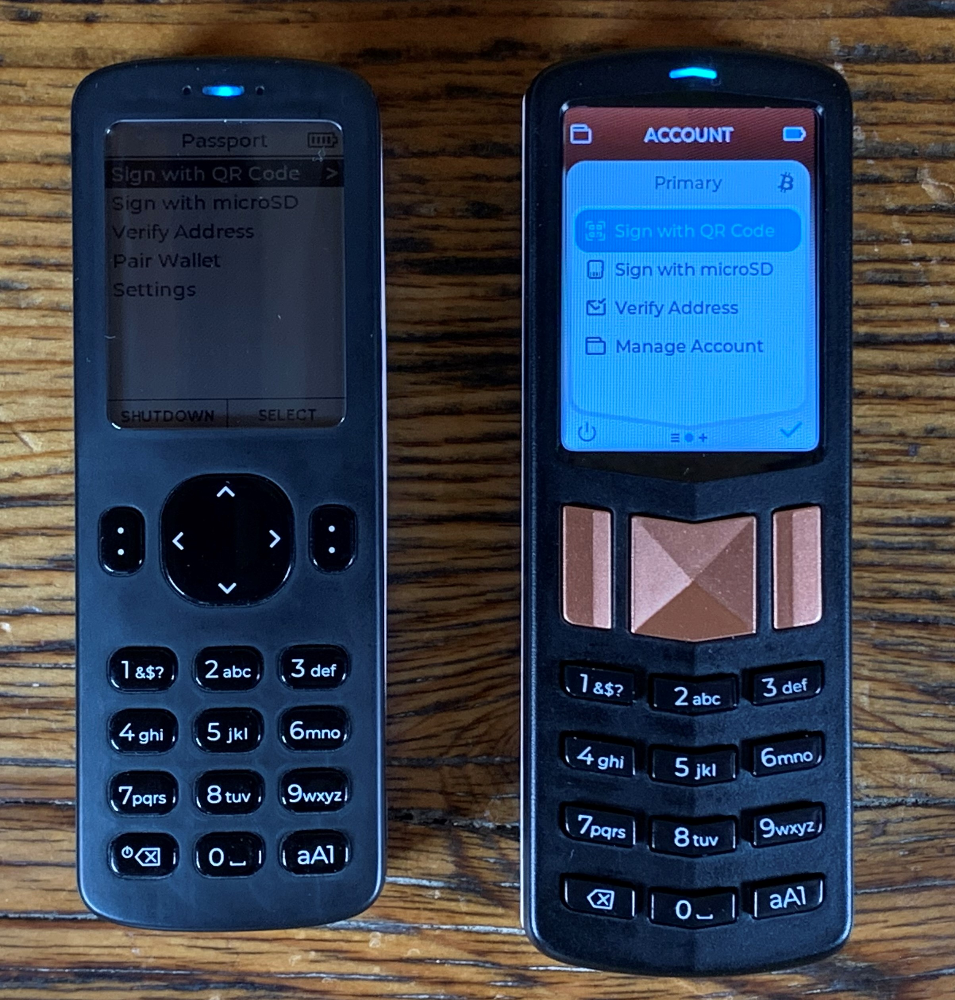
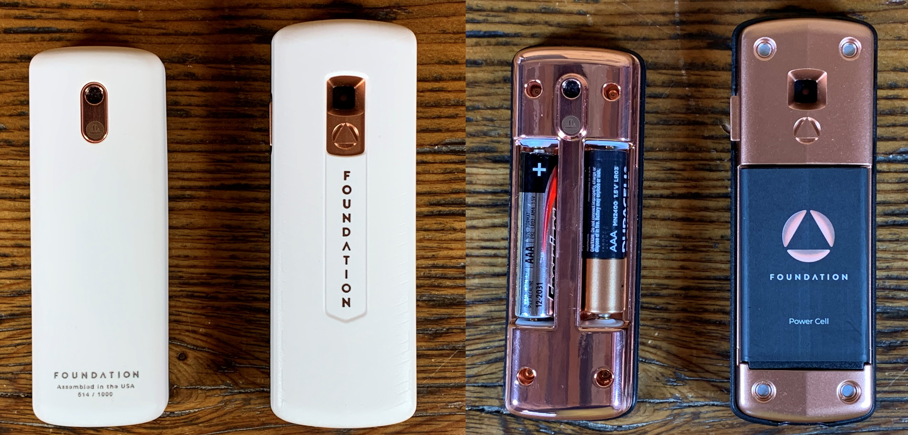
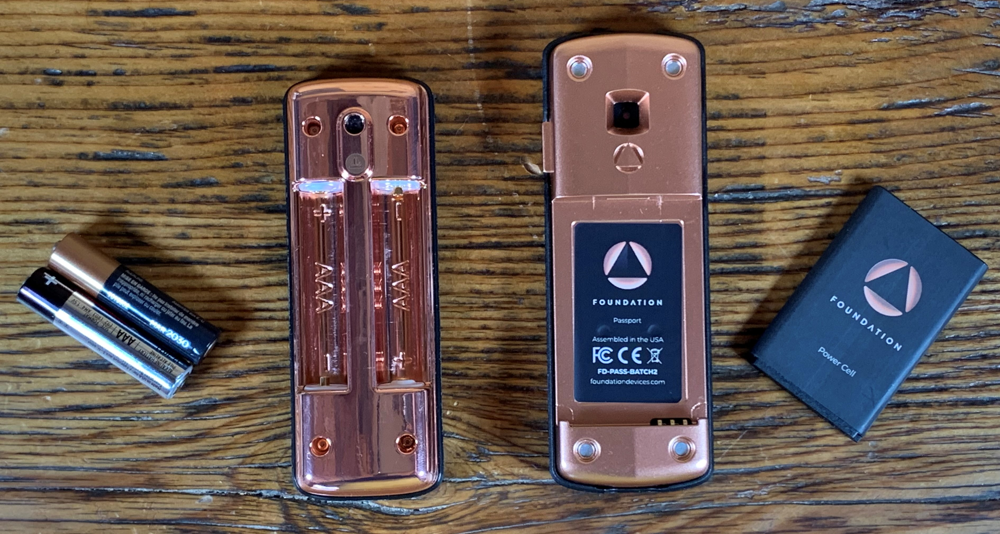
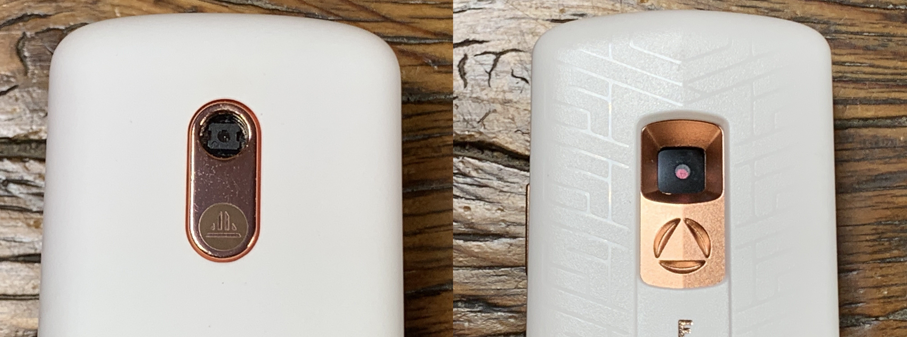

# Comparing the Founders Edition and Batch 2
Passport Batch 2 offer many upgrades over Passport Founders Edition. The following section describes these upgrades.

## Dimensions
Passport Founders Edition measures: 100mm long x 35mm wide x 23mm thick. 
Passport Batch 2 measures: 110mm long x 39mm wide x 19mm thick. 

  
  

  
## Ports
Passport Founders Edition features a single port, the microSD card port. Passport Batch 2 features a microSD card plus an USB-C port to charge the battery. The USB-C port is power-only and cannot transmit data. The microSD card port in Passport Batch 2 has more depth so that the microSD card can be inserted further, whereas the microSD card port on the Passport Founders Edition leaves roughly half the microSD card sticking out. 

  

  

## Keypads & Screens
The keypads on both Passports are similar in that they both feature alphanumeric keys. However, the Passport Founders Edition keys have more of an oval shape and the keys on the Passport Batch 2 version have more of a rectangular shape. The navigation keys on the Passport Batch 2 are copper in color, rectangular for the power & select controls, and square for the up/down/left/right controls. Whereas on the Passport Founders Edition, the power button shares the same key as the delete button. The key to the left of the up/down/left/right controls is dedicated to the shutdown function. The navigation controls on the Passport Founders Edition are more rounded in shape. 

The screen on the Passport Batch 2 is a high-resolution, color IPS display bounded to ultra strong glass. The display on the Passport Founders Edition has a plastic screen and it is not a color display. The brightness can be adjusted on both Passports. The display when measured diagonally is 43mm on the Passport Founders Edition and 50mm on the Passport Batch 2.  

  

 

## Batteries
Passport Batch 2 features a rechargeable and removable lithium ion battery with a 1,200 mAh rating. The Passport Founders Edition features two AAA batteries. The lithium ion battery has a much greater battery life. Both Passports feature a removable magnetic back piece to quickly access the batteries. 

  
  

## Cameras
Passport Batch 2 got an upgraded camera, the [Omnivision Cameracube](https://www.ovt.com/technologies/cameracubechip/), which makes scanning QR codes easier than the lesser quality camera on the Passport Founders Edition. 

  

## Software
Most of the menu options available on Passport Founders Edition are also available on Passport Batch 2. Some of the folder configurations are a little different but most of the options are there with the exception of signing a text file. Passport Batch 2 also introduces Extensions for Casa and Whirlpool which adds additional accounts in Passport that you can connect to. Both Passports can be connected to the Envoy app to make monitoring balances, generating receive addresses, and building transactions easier. 
