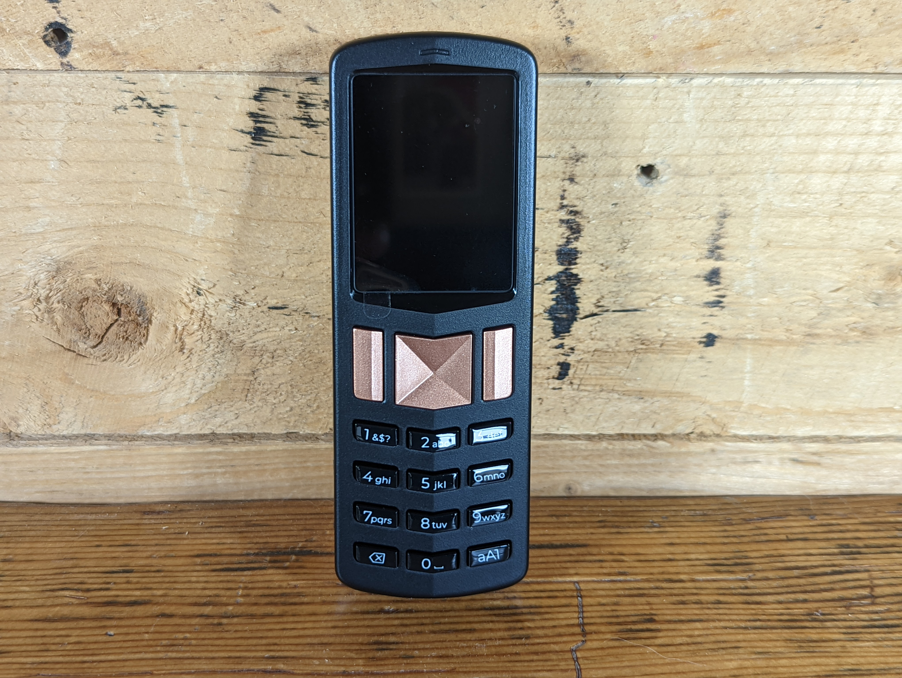

# Foundation Passport Batch 2 guide
The Passport Batch 2 is the second generation Bitcoin hardware wallet from [Foundation Devices](https://foundationdevices.com/). Passport Batch-2 is built in America, air-gapped, and open source. In this guide you will see how simple self-custody can be, the differences between the Founders Edition and Batch 2, and a select advanced feature of the new Passport Batch 2.  

